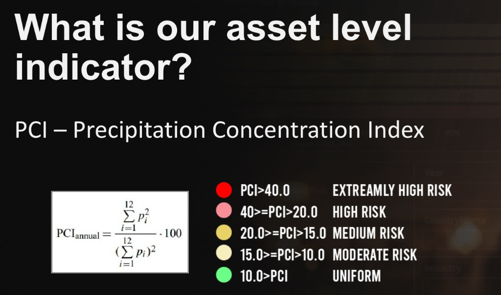

# Rainfall Risk Radar: Asset-Level Risk Indicator for Nippon Steel Corp.

This project develops a physical risk assessment framework to evaluate the impact of global rainfall distribution on 235 assets of **Nippon Steel Corporation**. By leveraging satellite-based meteorological data, we created a scalable indicator to identify high-vulnerability operational zones across 21 countries.

## 📊 Project Overview
* **The Challenge:** Assessing climate-related physical risks for a global industrial footprint.
* **The Data:** Hourly rain rates from **GSMap Operational Data** via **Google Earth Engine (GEE)**.
* **The Metric:** Implementation of the **Precipitation Concentration Index (PCI)** to quantify rainfall seasonality and intensity at the asset level.

---

## 🛠️ Data Engineering & Extraction
The core of this project is an automated pipeline that transforms raw satellite imagery into a structured, validated dataset ready for business intelligence.

  
*Figure 1: The data extraction workflow—from GEE exploration and Python base function development to PySpark-driven data integration.*

**Key Engineering Steps:**
1.  **GEE Integration:** Developed custom Python functions to fetch precipitation values for specific Coordinates (AOIs) and date ranges.
2.  **Scalability:** Used **PySpark** to merge granular meteorological data with company asset metadata.
3.  **Validation:** Performed a 95% accuracy check by validating randomly extracted satellite data against ground-truth sources.

---

## 📐 The Indicator: PCI Logic
To go beyond "average rainfall," we used the **Precipitation Concentration Index (PCI)**. This allows us to distinguish between areas with steady rain and areas at risk of sporadic, extreme storm events that can shut down steel production or logistics.

$$PCI = \frac{\sum_{i=1}^{12} p_i^2}{(\sum_{i=1}^{12} p_i)^2} \cdot 100$$

  
*Figure 2: Mathematical framework and the risk classification scale (Low to Extremely High) used for asset categorization.*

---

## 📈 Strategic Results
The final output is an integrated risk dashboard that provides a global view of Nippon Steel’s vulnerability.

  
*Figure 3: Rainfall Risk Radar Dashboard showing industry-specific risk concentrations.*

### **Key Insights:**
* **High-Risk Zones:** Pinpointed specific assets where high PCI scores indicate extreme seasonal volatility.
* **Industry Breakdown:** The "Steel" and "Metal/Mining" sectors represent the majority of "Extremely High Risk" locations, suggesting a need for localized flood-resilience infrastructure.

---

## 💻 Tech Stack
* **Geospatial:** Google Earth Engine (GEE), GSMap.
* **Data Processing:** Python, PySpark, Pandas.
* **Visualization:** Power BI / Matplotlib.

## 📂 Repository Structure
* `/notebooks`: Python scripts for GEE extraction and PCI calculation.
* `/reports`: Final technical report (PDF) and project slides.
* `/data`: Asset metadata (coordinates and industry types).
